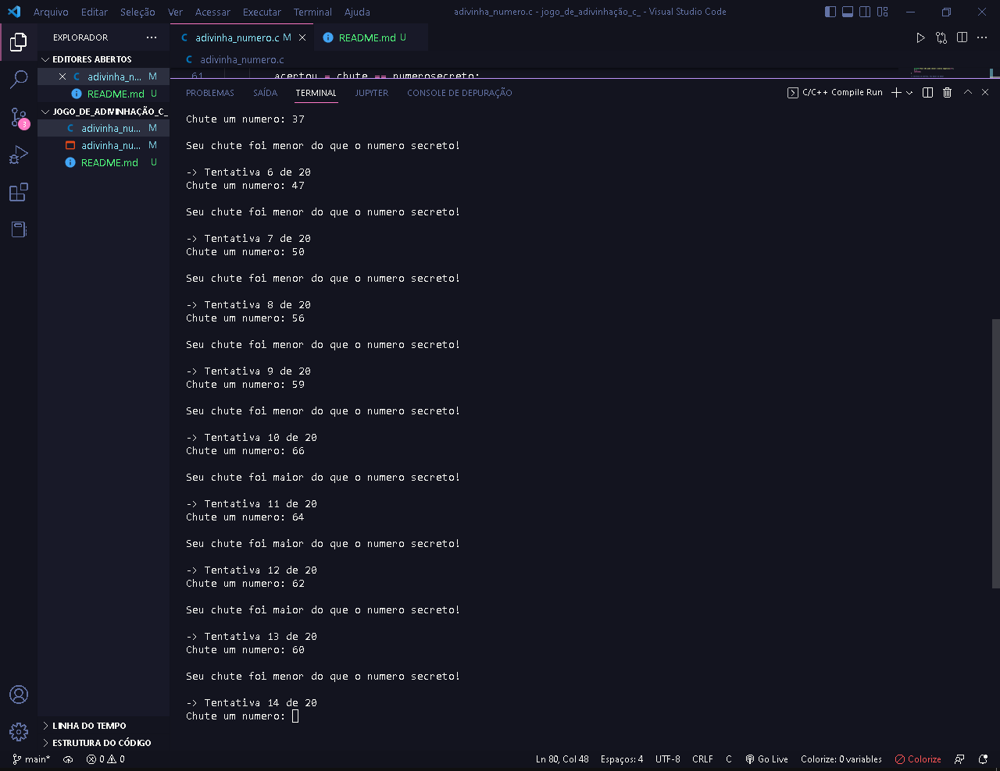

## Jogo Thinking Like a Computer 🖥️🤔💭
Ao rodar o jogo, o computador perguntará um `número` e, cuja resposta poderia ser 10, por exemplo, e o computador poderia retrucar informando que pensou em outro número, maior que 10. Então, você tenta o número 50, e o computador diz que é menor que 50. E assim será a "brincadeira" de `descobrir o número que o computador pensou`.

